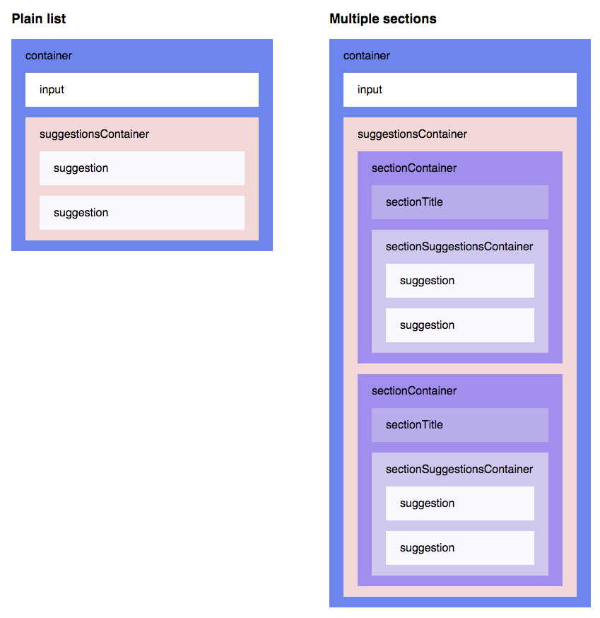

[](https://codeship.com/projects/67868)
[](https://github.com/moroshko/react-autosuggest/graphs/contributors)
[](https://codecov.io/gh/moroshko/react-autosuggest)

[](https://npmjs.org/package/react-autosuggest)
[](https://npmjs.org/package/react-autosuggest)


# React Autosuggest

## Demo

Check out the [Homepage](http://react-autosuggest.js.org) and the [Codepen examples](http://codepen.io/collection/DkkYaQ).

## Features

* [WAI-ARIA compliant](https://rawgit.com/w3c/aria-practices/master/aria-practices-DeletedSectionsArchive.html#autocomplete), with support for ARIA attributes and keyboard interactions
* Mobile friendly
* Plugs in nicely to Flux and [Redux](http://redux.js.org) applications
* Full control over [suggestions rendering](#renderSuggestionProp)
* Suggestions can be presented as [plain list](http://codepen.io/moroshko/pen/LGNJMy) or [multiple sections](http://codepen.io/moroshko/pen/qbRNjV)
* Suggestions can be retrieved [asynchronously](http://codepen.io/moroshko/pen/EPZpev)
* [Highlight the first suggestion](#highlightFirstSuggestionProp) in the list if you wish
* Supports styling using [CSS Modules](https://github.com/css-modules/css-modules), [Radium](https://github.com/FormidableLabs/radium), [Aphrodite](https://github.com/Khan/aphrodite), [JSS](https://github.com/cssinjs/jss), [and more](#themeProp)
* You decide [when to show suggestions](#shouldRenderSuggestionsProp) (e.g. when user types 2 or more characters)
* [Always render suggestions](#alwaysRenderSuggestionsProp) (useful for mobile and modals)
* [Pass through arbitrary props to the input](#inputPropsProp) (e.g. placeholder, type, [onChange](#inputPropsOnChange), [onBlur](#inputPropsOnBlur), or any other), or [take full control on the rendering of the input](#renderInputComponentProp) (useful for integration with other libraries)
* Thoroughly tested

## Installation

```shell
yarn add react-autosuggest
```

or

```shell
npm install react-autosuggest --save
```

You can also use the standalone UMD build:

```html
<script src="https://unpkg.com/react-autosuggest/dist/standalone/autosuggest.js"></script>
```

## Basic Usage

```js
import Autosuggest from 'react-autosuggest';

// Imagine you have a list of languages that you'd like to autosuggest.
const languages = [
  {
    name: 'C',
    year: 1972
  },
  {
    name: 'Elm',
    year: 2012
  },
  ...
];

// Teach Autosuggest how to calculate suggestions for any given input value.
const getSuggestions = value => {
  const inputValue = value.trim().toLowerCase();
  const inputLength = inputValue.length;

  return inputLength === 0 ? [] : languages.filter(lang =>
    lang.name.toLowerCase().slice(0, inputLength) === inputValue
  );
};

// When suggestion is clicked, Autosuggest needs to populate the input
// based on the clicked suggestion. Teach Autosuggest how to calculate the
// input value for every given suggestion.
const getSuggestionValue = suggestion => suggestion.name;

// Use your imagination to render suggestions.
const renderSuggestion = suggestion => (
  <div>
    {suggestion.name}
  </div>
);

class Example extends React.Component {
  constructor() {
    super();

    // Autosuggest is a controlled component.
    // This means that you need to provide an input value
    // and an onChange handler that updates this value (see below).
    // Suggestions also need to be provided to the Autosuggest,
    // and they are initially empty because the Autosuggest is closed.
    this.state = {
      value: '',
      suggestions: []
    };
  }

  onChange = (event, { newValue }) => {
    this.setState({
      value: newValue
    });
  };

  // Autosuggest will call this function every time you need to update suggestions.
  // You already implemented this logic above, so just use it.
  onSuggestionsFetchRequested = ({ value }) => {
    this.setState({
      suggestions: getSuggestions(value)
    });
  };

  // Autosuggest will call this function every time you need to clear suggestions.
  onSuggestionsClearRequested = () => {
    this.setState({
      suggestions: []
    });
  };

  render() {
    const { value, suggestions } = this.state;

    // Autosuggest will pass through all these props to the input.
    const inputProps = {
      placeholder: 'Type a programming language',
      value,
      onChange: this.onChange
    };

    // Finally, render it!
    return (
      <Autosuggest
        suggestions={suggestions}
        onSuggestionsFetchRequested={this.onSuggestionsFetchRequested}
        onSuggestionsClearRequested={this.onSuggestionsClearRequested}
        getSuggestionValue={getSuggestionValue}
        renderSuggestion={renderSuggestion}
        inputProps={inputProps}
      />
    );
  }
}
```

## Props

| Prop | Type | Required | Description |
| :--- | :--- | :---: | :--- |
| [`suggestions`](#suggestionsProp) | Array | ✓ | These are the suggestions that will be displayed. Items can take an arbitrary shape. |
| [`onSuggestionsFetchRequested`](#onSuggestionsFetchRequestedProp) | Function | ✓ | Will be called every time you need to recalculate `suggestions`. |
| [`onSuggestionsClearRequested`](#onSuggestionsClearRequestedProp) | Function | ✓[*](#onSuggestionsClearRequestedPropNote) | Will be called every time you need to set `suggestions` to `[]`. |
| [`getSuggestionValue`](#getSuggestionValueProp) | Function | ✓ | Implement it to teach Autosuggest what should be the input value when suggestion is clicked. |
| [`renderSuggestion`](#renderSuggestionProp) | Function | ✓ | Use your imagination to define how suggestions are rendered. |
| [`inputProps`](#inputPropsProp) | Object | ✓ | Pass through arbitrary props to the input. It must contain at least `value` and `onChange`. |
| [`onSuggestionSelected`](#onSuggestionSelectedProp) | Function | | Will be called every time suggestion is selected via mouse or keyboard. |
| [`onSuggestionHighlighted`](#onSuggestionHighlightedProp) | Function | | Will be called every time the highlighted suggestion changes. |
| [`shouldRenderSuggestions`](#shouldRenderSuggestionsProp) | Function | | When the input is focused, Autosuggest will consult this function when to render suggestions. Use it, for example, if you want to display suggestions when input value is at least 2 characters long. |
| [`alwaysRenderSuggestions`](#alwaysRenderSuggestionsProp) | Boolean | | Set it to `true` if you'd like to render suggestions even when the input is not focused. |
| [`highlightFirstSuggestion`](#highlightFirstSuggestionProp) | Boolean | | Set it to `true` if you'd like Autosuggest to automatically highlight the first suggestion. |
| [`focusInputOnSuggestionClick`](#focusInputOnSuggestionClickProp) | Boolean | | Set it to `false` if you don't want Autosuggest to keep the input focused when suggestions are clicked/tapped. |
| [`multiSection`](#multiSectionProp) | Boolean | | Set it to `true` if you'd like to display suggestions in multiple sections (with optional titles). |
| [`renderSectionTitle`](#renderSectionTitleProp) | Function | ✓<br>when `multiSection={true}` | Use your imagination to define how section titles are rendered. |
| [`getSectionSuggestions`](#getSectionSuggestionsProp) | Function | ✓<br>when `multiSection={true}` | Implement it to teach Autosuggest where to find the suggestions for every section. |
| [`renderInputComponent`](#renderInputComponentProp) | Function | | Use it only if you need to customize the rendering of the input. |
| [`renderSuggestionsContainer`](#renderSuggestionsContainerProp) | Function | | Use it if you want to customize things inside the suggestions container beyond rendering the suggestions themselves. |
| [`theme`](#themeProp) | Object | | Use your imagination to style the Autosuggest. |
| [`id`](#idProp) | String | | Use it only if you have multiple Autosuggest components on a page. |

<a name="suggestionsProp"></a>
#### suggestions (required)

Array of suggestions to display. The only requirement is that `suggestions` is an array. Items in this array can take an arbitrary shape.

For a plain list of suggestions, every item in `suggestions` represents a single suggestion. It's up to you what shape every suggestion takes. For example:

```js
const suggestions = [
  {
    text: 'Apple'
  },
  {
    text: 'Banana'
  },
  {
    text: 'Cherry'
  },
  {
    text: 'Grapefruit'
  },
  {
    text: 'Lemon'
  }
];
```

For [multiple sections](#multiSectionProp), every item in `suggestions` represents a single section. Again, it's up to you what shape every section takes. For example:

```js
const suggestions = [
  {
    title: 'A',
    suggestions: [
      {
        id: '100',
        text: 'Apple'
      },
      {
        id: '101',
        text: 'Apricot'
      }
    ]
  },
  {
    title: 'B',
    suggestions: [
      {
        id: '102',
        text: 'Banana'
      }
    ]
  },
  {
    title: 'C',
    suggestions: [
      {
        id: '103',
        text: 'Cherry'
      }
    ]
  }
];
```

<a name="onSuggestionsFetchRequestedProp"></a>
#### onSuggestionsFetchRequested (required)

This function will be called every time you might need to update [`suggestions`](#suggestionsProp). It has the following signature:

```js
function onSuggestionsFetchRequested({ value, reason })
```

where:

* `value` - the current value of the input
* `reason` - string describing why `onSuggestionsFetchRequested` was called. The possible values are:
  * `'input-changed'` - user typed something
  * `'input-focused'` - input was focused
  * `'escape-pressed'` - user pressed <kbd>Escape</kbd> to clear the input (and suggestions are shown for empty input)
  * `'suggestions-revealed'` - user pressed <kbd>Up</kbd> or <kbd>Down</kbd> to reveal suggestions
  * `'suggestion-selected'` - user selected a suggestion when `alwaysRenderSuggestions={true}`

<a name="onSuggestionsClearRequestedProp"></a>
#### onSuggestionsClearRequested (required unless `alwaysRenderSuggestions={true}`)

This function will be called every time you need to clear [`suggestions`](#suggestionsProp).

All you have to do in this function is to set `suggestions` to `[]`.

<a name="onSuggestionsClearRequestedPropNote"></a>
**Note:** When `alwaysRenderSuggestions={true}`, you don't have to implement this function.

<a name="getSuggestionValueProp"></a>
#### getSuggestionValue (required)

When user navigates the suggestions using the <kbd>Up</kbd> and <kbd>Down</kbd> keys, [the input value should be set according to the highlighted suggestion](https://rawgit.com/w3c/aria-practices/master/aria-practices-DeletedSectionsArchive.html#autocomplete). You design how suggestion is modelled. Therefore, it's your responsibility to tell Autosuggest how to map suggestions to input values.

This function gets the suggestion in question, and it should return a string. For example:

```js
function getSuggestionValue(suggestion) {
  return suggestion.text;
}
```

<a name="renderSuggestionProp"></a>
#### renderSuggestion (required)

Use your imagination to define how suggestions are rendered.

The signature is:

```js
function renderSuggestion(suggestion, { query, isHighlighted })
```

where:

* `suggestion` - The suggestion to render
* `query` - Used to highlight the matching string. As user types in the input, `query` will be equal to the trimmed value of the input. Then, if user interacts using the <kbd>Up</kbd> or <kbd>Down</kbd> keys, [the input will get the value of the highlighted suggestion](https://rawgit.com/w3c/aria-practices/master/aria-practices-DeletedSectionsArchive.html#autocomplete), but `query` will remain to be equal to the trimmed value of the input prior to the <kbd>Up</kbd> and <kbd>Down</kbd> interactions.
* `isHighlighted` - Whether or not the suggestion is highlighted.

It should return a string or a `ReactElement`. For example:

```js
function renderSuggestion(suggestion) {
  return (
    <span>{suggestion.text}</span>
  );
}
```

**Important:** `renderSuggestion` must be a pure function (we optimize rendering performance based on this assumption).

<a name="inputPropsProp"></a>
#### inputProps (required)

Autosuggest is a [controlled component](https://facebook.github.io/react/docs/forms.html#controlled-components). Therefore, you MUST pass at least a `value` and an `onChange` callback to the input. You can pass any other props as well. For example:

```js
const inputProps = {
  value,          // usually comes from the application state
  onChange,       // called every time the input value changes
  onBlur,         // called when the input loses focus, e.g. when user presses Tab
  type: 'search',
  placeholder: 'Enter city or postcode'
};
```

<a name="inputPropsOnChange"></a>
##### inputProps.onChange (required)

The signature is:

```js
function onChange(event, { newValue, method })
```

where:

* `newValue` - the new value of the input
* `method` - string describing how the change has occurred. The possible values are:
  * `'down'` - user pressed <kbd>Down</kbd>
  * `'up'` - user pressed <kbd>Up</kbd>
  * `'escape'` - user pressed <kbd>Escape</kbd>
  * `'enter'` - user pressed <kbd>Enter</kbd>
  * `'click'` - user clicked (or tapped) on suggestion
  * `'type'` - none of the methods above (usually means that user typed something, but can also be that they pressed Backspace, pasted something into the input, etc.)

<a name="inputPropsOnBlur"></a>
##### inputProps.onBlur (optional)

The signature is:

```js
function onBlur(event, { highlightedSuggestion })
```

where:

* `highlightedSuggestion` - the suggestion that was highlighted just before the input lost focus, or `null` if there was no highlighted suggestion.

<a name="onSuggestionSelectedProp"></a>
#### onSuggestionSelected (optional)

This function is called when suggestion is selected. It has the following signature:

```js
function onSuggestionSelected(event, { suggestion, suggestionValue, suggestionIndex, sectionIndex, method })
```

where:

* `suggestion` - the selected suggestion
* `suggestionValue` - the value of the selected suggestion (equivalent to `getSuggestionValue(suggestion)`)
* `suggestionIndex` - the index of the selected suggestion in the `suggestions` array
* `sectionIndex` - when rendering [multiple sections](#multiSectionProp), this will be the section index (in [`suggestions`](#suggestionsProp)) of the selected suggestion. Otherwise, it will be `null`.
* `method` - string describing how user selected the suggestion. The possible values are:
  * `'click'` - user clicked (or tapped) on the suggestion
  * `'enter'` - user selected the suggestion using <kbd>Enter</kbd>

<a name="onSuggestionHighlightedProp"></a>
#### onSuggestionHighlighted (optional)

This function is called when the highlighted suggestion changes. It has the following signature:

```js
function onSuggestionHighlighted({ suggestion })
```

where:
* `suggestion` - the highlighted suggestion, or `null` if there is no highlighted suggestion.

<a name="shouldRenderSuggestionsProp"></a>
#### shouldRenderSuggestions (optional)

By default, suggestions are rendered when the input isn't blank. Feel free to override this behaviour.

This function gets the current value of the input, and it should return a boolean.

For example, to display suggestions only when input value is at least 3 characters long, do:

```js
function shouldRenderSuggestions(value) {
  return value.trim().length > 2;
}
```

When `shouldRenderSuggestions` returns `true`, **suggestions will be rendered only when the input is focused**.

If you would like to render suggestions regardless of whether the input is focused or not, set `alwaysRenderSuggestions={true}` (`shouldRenderSuggestions` is ignored in this case).

<a name="alwaysRenderSuggestionsProp"></a>
#### alwaysRenderSuggestions (optional)

Set `alwaysRenderSuggestions={true}` if you'd like to always render the suggestions.

**Important:** Make sure that the initial value of `suggestions` corresponds to the initial value of `inputProps.value`. For example, if you'd like to show all the suggestions when the input is empty, your initial state should be something like:
```js
this.state = {
  value: '',
  suggestions: allSuggestions
};
```

<a name="highlightFirstSuggestionProp"></a>
#### highlightFirstSuggestion (optional)

When `highlightFirstSuggestion={true}`, Autosuggest will automatically highlight the first suggestion. Defaults to `false`.

<a name="focusInputOnSuggestionClickProp"></a>
#### focusInputOnSuggestionClick (optional)

By default, `focusInputOnSuggestionClick={true}`, which means that, every time suggestion is clicked (or tapped), the input keeps the focus.

On mobile devices, when the input is focused, the native keyboard appears. You'll probably want to lose the focus when suggestion is tapped in order to hide the keyboard.

You can do something like this:

```xml
<Autosuggest focusInputOnSuggestionClick={!isMobile} ... />
```

where `isMobile` is a boolean describing whether Autosuggest operates on a mobile device or not. You can use [kaimallea/isMobile](https://github.com/kaimallea/isMobile), for example, to determine that.

<a name="multiSectionProp"></a>
#### multiSection (optional)

By default, Autosuggest renders a plain list of suggestions.

If you'd like to have multiple sections (with optional titles), set `multiSection={true}`.

<a name="renderSectionTitleProp"></a>
#### renderSectionTitle (required when `multiSection={true}`)

When rendering [multiple sections](#multiSectionProp), you need to tell Autosuggest how to render a section title.

This function gets the section to render (an item in the [suggestions](#suggestionsProp) array), and it should return a string or a `ReactElement`. For example:

```js
function renderSectionTitle(section) {
  return (
    <strong>{section.title}</strong>
  );
}
```

If `renderSectionTitle` returns `null` or `undefined`, section title is not rendered.

<a name="getSectionSuggestionsProp"></a>
#### getSectionSuggestions (required when `multiSection={true}`)

When rendering [multiple sections](#multiSectionProp), you need to tell Autosuggest where to find the suggestions for a given section.

This function gets the section to render (an item in the [suggestions](#suggestionsProp) array), and it should return an array of suggestions to render in the given section. For example:

```js
function getSectionSuggestions(section) {
  return section.suggestions;
}
```

**Note:** Sections with no suggestions are not rendered.

<a name="renderInputComponentProp"></a>
#### renderInputComponent (optional)

You shouldn't specify `renderInputComponent` unless you want to customize the rendering of the input.

To keep Autosuggest [accessible](https://rawgit.com/w3c/aria-practices/master/aria-practices-DeletedSectionsArchive.html#autocomplete), `renderInputComponent` MUST:

* render an input
* pass through all the provided `inputProps` to the input

Example:

```js
const renderInputComponent = inputProps => (
  <div>
    <input {...inputProps} />
    <div>custom stuff</div>
  </div>
);

```

**Note:** When using `renderInputComponent`, you still need to specify the usual [`inputProps`](#inputPropsProp). Autosuggest will merge the `inputProps` that you provide with other props that are needed for accessibility (e.g. `'aria-activedescendant'`), and will pass the **merged `inputProps`** to `renderInputComponent`.

<a name="renderSuggestionsContainerProp"></a>
#### renderSuggestionsContainer (optional)

You shouldn't specify `renderSuggestionsContainer` unless you want to customize the content or behaviour of the suggestions container beyond rendering the suggestions themselves. For example, you might want to add a custom text before/after the suggestions list, or to [customize the scrolling behaviour of the suggestions container](https://github.com/moroshko/react-autosuggest/blob/master/FAQ.md#limitSuggestionsContainerScrolling).

The signature is:

```js
function renderSuggestionsContainer({ containerProps, children, query })
```

where:

* `containerProps` - props that you MUST pass to the topmost element that is returned from `renderSuggestionsContainer`.
* `children` - the suggestions themselves. It's up to you where to render them.
* `query` - Same as `query` in [`renderSuggestion`](#renderSuggestionProp).

For example:

```js
function renderSuggestionsContainer({ containerProps , children, query }) {
  return (
    <div {... containerProps}>
      {children}
      <div>
        Press Enter to search <strong>{query}</strong>
      </div>
    </div>
  );
}
```

When `renderSuggestionsContainer` returns a composite component (e.g. `<IsolatedScroll ... />` as opposed to a DOM node like `<div ... />`), you MUST call `containerProps.ref` with the topmost element that the composite component renders.

For example:

```js
import IsolatedScroll from 'react-isolated-scroll';

function renderSuggestionsContainer({ containerProps, children }) {
  const { ref, ...restContainerProps } = containerProps;
  const callRef = isolatedScroll => {
    if (isolatedScroll !== null) {
      ref(isolatedScroll.component);
    }
  };

  return (
    <IsolatedScroll ref={callRef} {...restContainerProps}>
      {children}
    </IsolatedScroll>
  );
}
```

<a name="themeProp"></a>
#### theme (optional)

Autosuggest comes with no styles.

It uses [react-themeable](https://github.com/markdalgleish/react-themeable) that allows you to style your Autosuggest component using [CSS Modules](https://github.com/css-modules/css-modules), [Radium](https://github.com/FormidableLabs/radium), [Aphrodite](https://github.com/Khan/aphrodite), [JSS](https://github.com/cssinjs/jss), [Inline styles](https://facebook.github.io/react/docs/dom-elements.html#style), and global CSS.

For example, to style the Autosuggest using CSS Modules, do:

```css
/* theme.css */

.container { ... }
.input { ... }
.suggestionsContainer { ... }
.suggestion { ... }
.suggestionHighlighted { ... }
...
```

```js
import theme from 'theme.css';
```
```xml
<Autosuggest theme={theme} ... />
```

When not specified, `theme` defaults to:

```js
{
  container:                'react-autosuggest__container',
  containerOpen:            'react-autosuggest__container--open',
  input:                    'react-autosuggest__input',
  inputOpen:                'react-autosuggest__input--open',
  inputFocused:             'react-autosuggest__input--focused',
  suggestionsContainer:     'react-autosuggest__suggestions-container',
  suggestionsContainerOpen: 'react-autosuggest__suggestions-container--open',
  suggestionsList:          'react-autosuggest__suggestions-list',
  suggestion:               'react-autosuggest__suggestion',
  suggestionFirst:          'react-autosuggest__suggestion--first',
  suggestionHighlighted:    'react-autosuggest__suggestion--highlighted',
  sectionContainer:         'react-autosuggest__section-container',
  sectionContainerFirst:    'react-autosuggest__section-container--first',
  sectionTitle:             'react-autosuggest__section-title'
}
```

The following picture illustrates how `theme` keys correspond to Autosuggest DOM structure:



<a name="idProp"></a>
#### id (required when multiple Autosuggest components are rendered on a page)

The only reason `id` exists, is to set ARIA attributes (they require a unique id).

When rendering a single Autosuggest, don't set the `id` (it will be set to `'1'`, by default).

When rendering multiple Autosuggest components on a page, make sure to give them unique `id`s. For example:

```xml
<Autosuggest id="source" ... />
<Autosuggest id="destination" ... />
```

## Development

```shell
npm install
npm start
```

Now, open `http://localhost:3000/demo/dist/index.html` and start hacking!

## License

[MIT](http://moroshko.mit-license.org)
